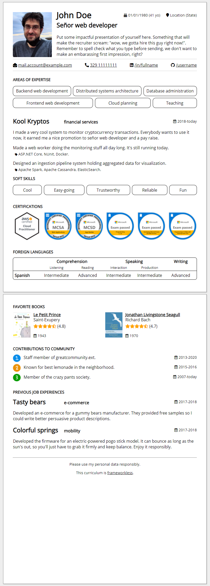

# frameworkless-curriculum
So, you want to find a new job, huh? Why not make your _curriculum vitae_ in HTML and, while your at it, make some practice on how <a href="https://developer.mozilla.org/en-US/docs/Web/Web_Components">Web Components</a> work? And when you're finally done, you'll have a new skill added to your toolbox!

## Getting started
 * First install dependencies with `npm install` and then launch the browser with `npm run serve`;
 * Edit the `index.html` and type in your info and stuff. You can use all the custom Web Components defined in the `elements` directory;
 * If you want to add a new one, copy-paste one of the existing ones. Remember to use a name containing an hyphen, as requested by the specifics. Then register it in the `index.js` file;
 * Press `CTRL+P` in your browser to print it to PDF!

## Sample
